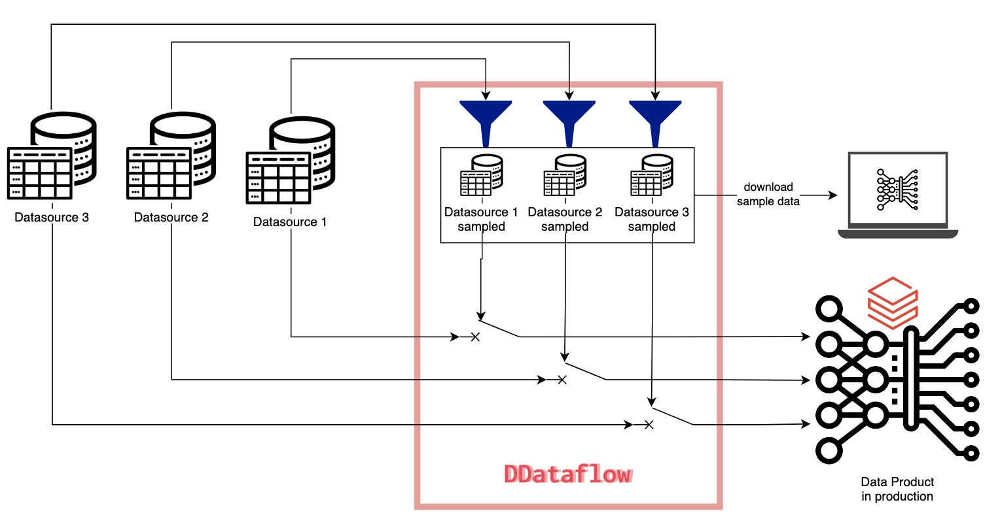

# DDataFlow

DDataFlow is an end2end tests and local development solution for machine learning and data pipelines using pyspark.
Check out this blogpost if you want to [understand deeper its design motivation](https://www.getyourguide.careers/posts/ddataflow-a-tool-for-data-end-to-end-tests-for-machine-learning-pipelines).



You can find our documentation in the [docs folder](https://github.com/getyourguide/DDataFlow/tree/main/docs). And see the complete code reference [here](https://code.getyourguide.com/DDataFlow/ddataflow/ddataflow.html).

## Features

- Read a subset of our data so to speed up the running of the pipelines during tests
- Write to a test location our artifacts so you don't pollute production
- Download data for enabling local machine development

Enables to run on the pipelines in the CI

## 1. Install DDataflow

```sh
pip install ddataflow 
```

`ddataflow --help` will give you an overview of the available commands.


# Getting Started (<5min Tutorial)

This tutorial aims to show you the core features though, for the complete reference see the [integration manual](docs/integrator_manual.md) in the docs.

## 1. Setup some synthetic data

See the [examples folder](examples/pipeline.py).

## 2. Create a ddataflow_config.py file

The command `ddtaflow setup_project` creates a file like this for you.

```py
from ddataflow import DDataflow

config = {
    # add here your tables or paths with customized sampling logic
    "data_sources": {
        "demo_tours": {
            "source": lambda spark: spark.table('demo_tours'),
            "filter": lambda df: df.limit(500)
        }
        "demo_locations": {
            "source": lambda spark: spark.table('demo_locations'),
            "default_sampling": True,
        }
    },
    "project_folder_name": "ddataflow_demo",
}

# initialize the application and validate the configuration
ddataflow = DDataflow(**config)
```

## 3. Use ddataflow in a pipeline

```py
from ddataflow_config import ddataflow

# replace spark.table for ddataflow source will return a spark dataframe
print(ddataflow.source('demo_locations').count())
# for sql queries replace only the name of the table for the sample data source name provided by ddataflow
print(spark.sql(f""" SELECT COUNT(1) from {ddataflow.name('demo_tours')}""").collect()[0]['count(1)'])
```

Now run it twice and observe the difference in the amount of records:
`python pipeline.py`

`ENABLE_DDATAFLOW=True python pipeline.py`

You will see that the dataframes are sampled when ddataflow is enabled and full when the tool is disabled.

You completed the short demo!

## How to develop

The recommended approach to use ddataflow is to use the offline mode, which allows you to test your pipelines without the need for an active cluster. This is especially important for development and debugging purposes, as it allows you to quickly test and identify any issues with your pipelines.

Alternatively, you can use Databricks Connect to test your pipelines on an active cluster. However, our experience with this approach has not been great, memory issues are common and there is the risk of overriding production data, so we recommend using the offline mode instead.

If you have any questions or need any help, please don't hesitate to reach out. We are here to help you get the most out of ddataflow.


## Support

In case of questions feel free to reach out or create an issue.

Check out our [FAQ in case of problems](https://github.com/getyourguide/DDataFlow/blob/main/docs/FAQ.md)

## Contributing

We welcome contributions to DDataFlow! If you would like to contribute, please follow these guidelines:

1. Fork the repository and create a new branch for your contribution.
2. Make your changes and ensure that the code passes all tests.
3. Submit a pull request with a clear description of your changes and the problem it solves.

Please note that all contributions are subject to review and approval by the project maintainers. We appreciate your help in making DDataFlow even better!

If you have any questions or need any help, please don't hesitate to reach out. We are here to assist you throughout the contribution process.

## License
DDataFlow is licensed under the [MIT License](https://github.com/getyourguide/DDataFlow/blob/main/LICENSE).
